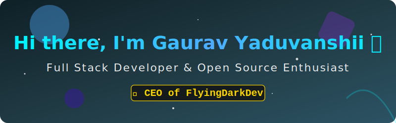
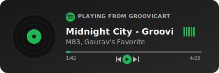

  

<h3 align="center">
    🚀 Turning caffeine into code | 🎵 Always vibing | 🌟 Open Source Explorer
</h3>

  

 

  

---

### 🎧 My Coding Soundtrack

  

---

### 👨‍💻 About Me

- 🏢 **Role:** CEO & Founder of **FlyingDarkDev**
- 🔭 **Currently working on:** Exciting open-source projects and web applications.
- 🌱 **Currently learning:** Advanced System Design, Web3, and cool new frameworks.
- 👯 **Looking to collaborate on:** Innovative and impactful open-source tools.
- 📫 **How to reach me:** Shoot me an email at xgauravyaduvanshii@gmail.com
- ⚡ **Fun fact:** I can debug code in my sleep. (Okay, maybe just dreaming of syntax errors!)

---

### 🛠️ Languages and Tools

  

 

    
    
    
    
    
    

---

### 🌟 Featured Open Source Projects

<table width="100%">
  <tr>
    <td width="50%">
      <h3 align="center">🤖 <a href="https://github.com/xgauravyaduvanshii/invisible-ai-assistant">Invisible AI Assistant</a></h3>
      
A stealthy, always-on-top AI desktop agent that controls your computer while staying invisible to screen captures.

      

    </td>
    <td width="50%">
      <h3 align="center">⚡ <a href="https://github.com/xgauravyaduvanshii/Blacky">Blacky</a></h3>
      
Production-ready platform to run modern apps. You bring the storage, we provide the runtime.

      

    </td>
  </tr>
  <tr>
    <td width="50%">
      <h3 align="center">🌐 <a href="https://github.com/xgauravyaduvanshii/flyingdarkdevtunnel">FlyingDarkDev Tunnel</a></h3>
      
Open-source ngrok alternative for HTTP/HTTPS/TCP tunneling with a full SaaS-ready platform.

      

    </td>
    <td width="50%">
      <h3 align="center">🎨 <a href="https://github.com/xgauravyaduvanshii/hidewhiteboard">HideWhiteboard</a></h3>
      
Next-Generation AI-Powered Open Whiteboard Platform with real-time collaboration and infinite canvas.

      

    </td>
  </tr>
   <tr>
    <td width="50%">
      <h3 align="center">🕸️ <a href="https://github.com/xgauravyaduvanshii/wormnetwork">WormNetwork</a></h3>
      
God-Level Network Booster & Multi-Threaded HTTP SOCKS5 Tunnel Accelerator.

      

    </td>
    <td width="50%">
      <h3 align="center">🖌️ <a href="https://github.com/xgauravyaduvanshii/BlackyFigma">BlackyFigma</a></h3>
      
Transform your Figma designs into production-ready React components with Tailwind CSS automatically.

      

    </td>
  </tr>
</table>

---

### 🔥 GitHub Analytics

  
  

 

    

---

### 📫 Connect with me

  
  
  
  
  

 

  
<i>Made with</i> ❤️ <i>and code by the CEO of FlyingDarkDev</i>

